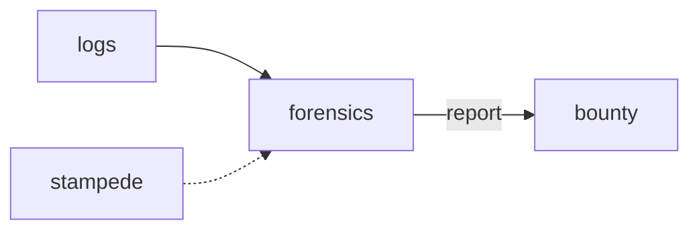

# Forensics

**Log Analyzer** — Dev tool to parse Java, GPU, and overlay crash logs into a Bounty-ready report.

Part of [ComputerPets](https://github.com/RicheyWorks/computerpets). Map: [computerpets-ecosystem](https://github.com/RicheyWorks/computerpets-ecosystem).

| | |
| --- | --- |
| Status | Design scaffold — contract frozen, implementation next |
| License | MIT |
| First pet | Still [Rui on the desktop](https://github.com/RicheyWorks/computerpets/blob/main/docs/START-HERE.md). This organ is optional. |

## The job

Desktop + Spring + CUDA means ugly stacks. Forensics turns a folder of logs into a severity, a fingerprint, and a redacted gist.

The flagship overlay already puts a living sticker on the real desktop (Rui first, 210 kinds). Forensics does not replace that. It is one organ.

## Who uses it

Developers and Bounty. Folder of logs in, redacted report out.

## What it is not

Not a telemetry pipe. `--share` is required to upload anything.

## Architecture



## Stack

Python 3.12 · CLI · Java hs_err / GPU crash parsers · Electron/Node overlay logs · redaction

GroupId / namespace: `com.enterprisepet.forensics`  
Default listen: `CLI`

## Contract

### Data

`Crash(kind=java|gpu|overlay, fingerprint) · Redaction(home, token, steamId) · Report(md, severity)`

### Surface

- CLI: forensics parse ./logs
- CLI: forensics fingerprint — cluster crashes
- POST /v1/ingest — optional CI hook

### Failure doctrine

Unknown format → keep raw in an appendix. PII regex miss → default strip user profile paths. Never upload without --share.

## First slice

Build this and stop. Do not boil the ocean.

**Parse a Java `hs_err` + overlay log, fingerprint, strip `%USERPROFILE%`.**

You know it works when: Unknown format kept as appendix. Default strip home paths. No upload without --share.

## Environment

None. Optional `BOUNTY_URL`.

Never commit secrets. Never put Steam or chain keys in the overlay.

## Neighbors

- computerpets-bounty
- computerpets-patcher
- computerpets-telemetry
- computerpets-stampede

## Layout

```
computerpets-forensics/
  README.md           this file
  LICENSE             MIT
  docs/CONTRACT.md    the same contract, frozen for implementers
  src/                implementation lands here
```

## Run (Windows)

PowerShell, from this folder, after the flagship helpers (Git, Node LTS 22+, JDK 21 as needed):

```powershell
python -m venv .venv; pip install -e .; forensics parse .\logs
```

You do not need this service to meet Rui. The [flagship start-here](https://github.com/RicheyWorks/computerpets/blob/main/docs/START-HERE.md) is still the first pet.

## Links

- Flagship: [RicheyWorks/computerpets](https://github.com/RicheyWorks/computerpets)
- This repo: [RicheyWorks/computerpets-forensics](https://github.com/RicheyWorks/computerpets-forensics)
- Map: [RicheyWorks/computerpets-ecosystem](https://github.com/RicheyWorks/computerpets-ecosystem)
- Contract file: [docs/CONTRACT.md](docs/CONTRACT.md)

## License

MIT. See [LICENSE](LICENSE).

---

*Two hundred ten living kinds. Keep them so a line does not go quiet.*
