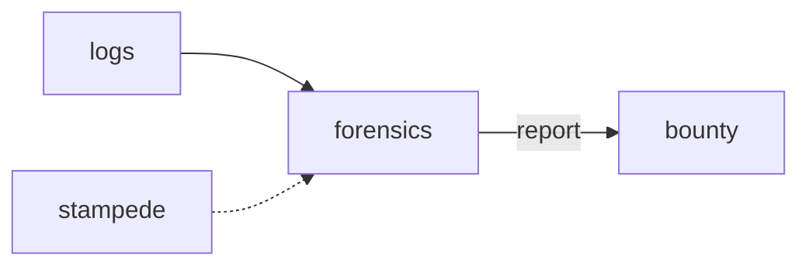

# Forensics

**Log Analyzer** — A planned local log analyzer for turning Java, GPU, and overlay crashes into redacted reports.

Part of [ComputerPets](https://github.com/RicheyWorks/computerpets). Map: [computerpets-ecosystem](https://github.com/RicheyWorks/computerpets-ecosystem).

[Status](#status) · [Contract](docs/CONTRACT.md) · [Contributor start](#contributor-start) · [Ecosystem](https://github.com/RicheyWorks/computerpets-ecosystem)

| Project | At a glance |
| --- | --- |
| Status | Design scaffold; not runnable yet |
| License | MIT |
| First pet | [Flagship start guide](https://github.com/RicheyWorks/computerpets/blob/main/docs/START-HERE.md) |

## Status

This repository contains a [contract](docs/CONTRACT.md) and a [source placeholder](src/forensics/__init__.py). It has no runnable application, build manifest, automated tests, or CI workflow.

The experience, interfaces, integrations, and safeguards below are **implementation plans**, not supported features. The first implementation slice defines the initial contribution target.

## Planned role

Desktop + Spring + CUDA means ugly stacks. Forensics turns a folder of logs into a severity, a fingerprint, and a redacted gist.

For the desktop pet, start with the [flagship guide](https://github.com/RicheyWorks/computerpets/blob/main/docs/START-HERE.md).

## Intended audience

Developers and Bounty. Folder of logs in, redacted report out.

## Out of scope

Not a telemetry pipe. `--share` is required to upload anything.

## Proposed integration



## Planned stack

Python 3.12 · CLI · Java hs_err / GPU crash parsers · Electron/Node overlay logs · redaction

GroupId / namespace: `com.enterprisepet.forensics`  
Proposed listen surface: `CLI`

## Proposed contract

### Data

`Crash(kind=java|gpu|overlay, fingerprint) · Redaction(home, token, steamId) · Report(md, severity)`

### Surface

- CLI: forensics parse ./logs
- CLI: forensics fingerprint — cluster crashes
- POST /v1/ingest — optional CI hook

### Planned safeguards

Unknown format → keep raw in an appendix. PII regex miss → default strip user profile paths. Never upload without --share.

## First implementation slice

Initial implementation target:

**Parse a Java `hs_err` + overlay log, fingerprint, strip `%USERPROFILE%`.**

Acceptance targets: Unknown format kept as appendix. Default strip home paths. No upload without --share.

## Planned environment

None. Optional `BOUNTY_URL`.

Never commit secrets. Never put Steam or chain keys in the overlay.

## Related projects

- [computerpets-bounty](https://github.com/RicheyWorks/computerpets-bounty)
- [computerpets-patcher](https://github.com/RicheyWorks/computerpets-patcher)
- [computerpets-telemetry](https://github.com/RicheyWorks/computerpets-telemetry)
- [computerpets-stampede](https://github.com/RicheyWorks/computerpets-stampede)

## Layout

```
computerpets-forensics/
  README.md           this file
  LICENSE             MIT
  docs/CONTRACT.md    the same contract, frozen for implementers
  src/                implementation lands here
```

## Contributor start

With Git and PowerShell, clone the scaffold and read its contract and source marker:

```powershell
git clone https://github.com/RicheyWorks/computerpets-forensics.git
Set-Location computerpets-forensics
Get-Content .\docs\CONTRACT.md
Get-Content .\src\forensics\__init__.py
```

Start with the [first implementation slice](#first-implementation-slice). Add the minimum project setup and tests needed for that slice, then document verified run commands. The proposed stack above is a design choice; there is no install or launch command for this checkout yet.

## Links

- Flagship: [RicheyWorks/computerpets](https://github.com/RicheyWorks/computerpets)
- This repo: [RicheyWorks/computerpets-forensics](https://github.com/RicheyWorks/computerpets-forensics)
- Map: [RicheyWorks/computerpets-ecosystem](https://github.com/RicheyWorks/computerpets-ecosystem)
- Contract file: [docs/CONTRACT.md](docs/CONTRACT.md)

## License

MIT. See [LICENSE](LICENSE).

---

*Two hundred ten living kinds. Keep them so a line does not go quiet.*
